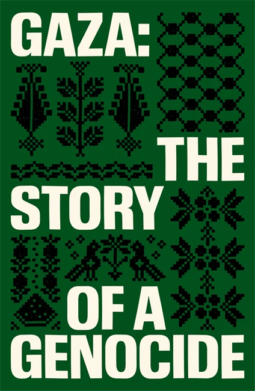
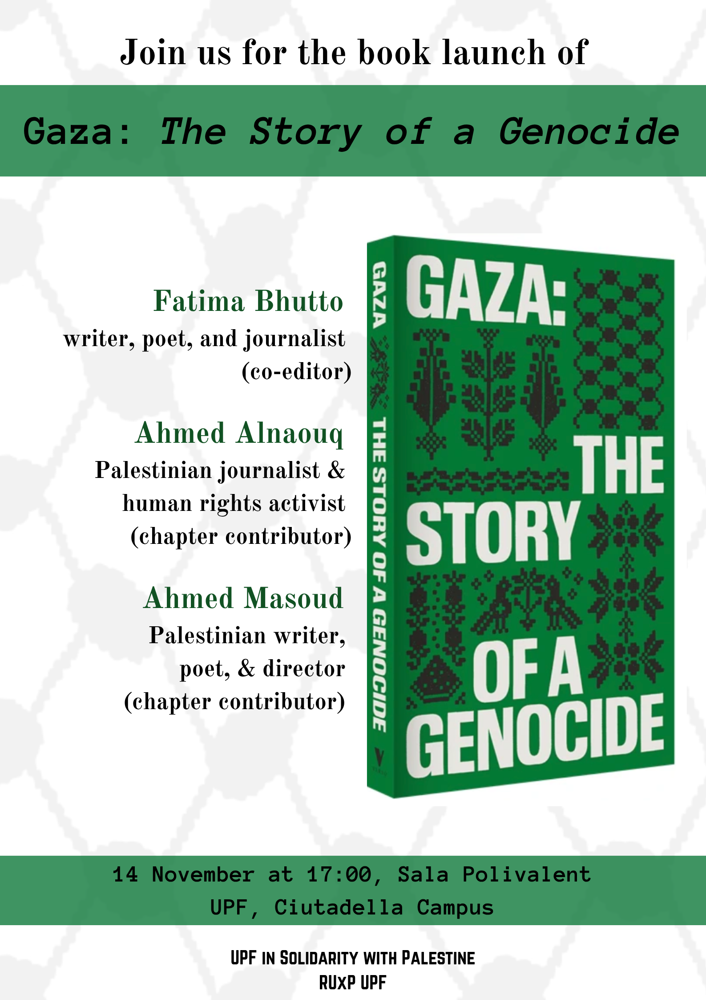

**A book talk by Fatima Bhutto, Ahmed Alnaouq, and Ahmed Masoud**

**Friday, 14 November 2025, at 18:00** 

**Sala Polivalent** (Located in the [Mercè Rodoreda building](https://www.upf.edu/en/web/campus/merce-rodoreda)) 
**Ciutadella Campus** 
**Universitat Pompeu Fabra**

Hosted by the [UPF in Solidarity with Palestine collective](https://upfxpalestina.github.io), the [Red Universitaria por Palestina (RUxP)](https://www.redxpalestina.org), and the [UPF Faculty of Political and Social Sciences](https://www.upf.edu/en/web/politiques/home).

Directions to the building: [https://www.upf.edu/en/web/campus/merce-rodoreda](https://www.upf.edu/en/web/campus/merce-rodoreda) 

Purchase the book: 

 

Download Poster: 

